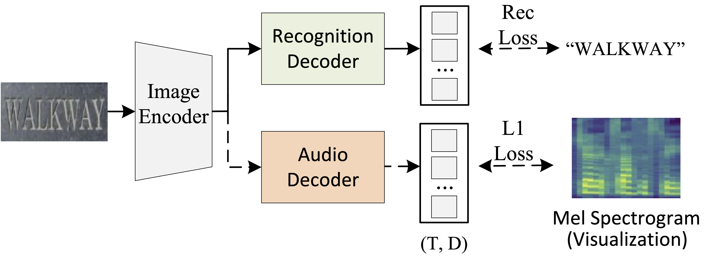

## Looking and Listening: Audio Guided Text Recognition

<a href="https://arxiv.org/abs/2306.03482">"></a>

The official code for the paper "Looking and Listening: Audio Guided Text Recognition". 

Comming soon.

## Introduction

**Abstract.** Text recognition in the wild is a long-standing problem in computer vision. Driven by end-to-end deep learning, recent studies suggest vision and language processing are effective for scene text recognition. Yet, solving edit errors such as add, delete, or replace is still the main challenge for existing approaches. In fact, the content of the text and its audio are naturally corresponding to each other, i.e., a single character error may result in a clear different pronunciation. In this paper, we propose the AudioOCR, a simple yet effective probabilistic audio decoder for mel spectrogram sequence prediction to guide the scene text recognition, which only participates in the training phase and brings no extra cost during the inference stage. The underlying principle of AudioOCR can be easily applied to the existing approaches. Experiments using 7 previous scene text recognition methods on 12 existing regular, irregular, and occluded benchmarks demonstrate our proposed method can bring consistent improvement. More importantly, through our experimentation, we show that AudioOCR possesses a generalizability that extends to more challenging scenarios, including recognizing non-English text, out-of-vocabulary words, and text with various accents.

